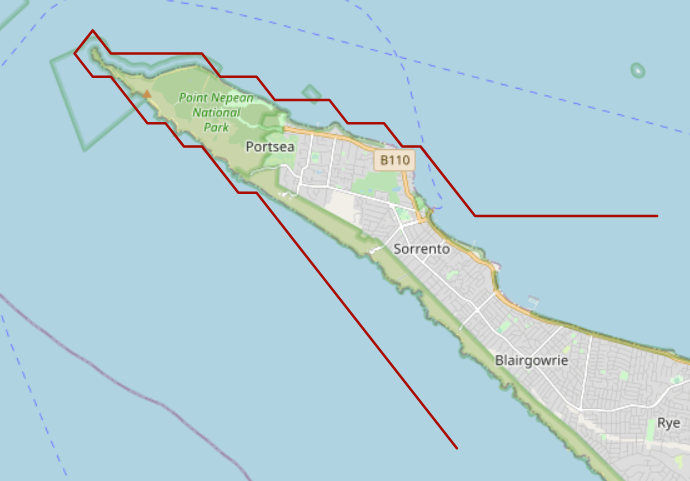
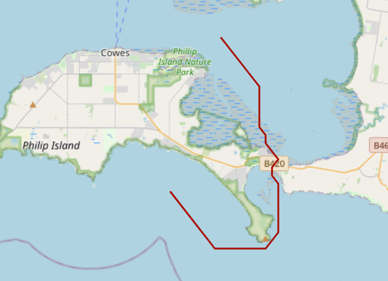

PolyRouter is designed to generate a grid-based route within a polygon.
The primary use case is to determine the shortest marine route without crossing land.
This can be done by creating a polygon of the sea/ocean/river where the vessel is allowed to traverse.
This is particularly useful when navigating around islands, peninsulas or other features where a straight line route cannot be taken.

## Description
This implements A* routing. Rather than requiring routing edges and vertices to be pre-generated, this generates edges
dynamically and then checks if they remain within the polygon.

PolyRouter works in a Cartesian plane. To calculate distance you will need to calculate
separately using geodetic calculations. It is agnostic for whatever CRS used.

PolyRouter can read a polygon from a shapefile or from WKT.

Consider adding a buffer on the shoreline to prevent points being too close to shore.
This will not consider depth or other marine routing considerations such as shipping channels.
The primary intention is to give an approximate versus straight line distance.

## Examples
Point Nepean, Victoria, Australia

Phillip Island, Victoria, Australia
